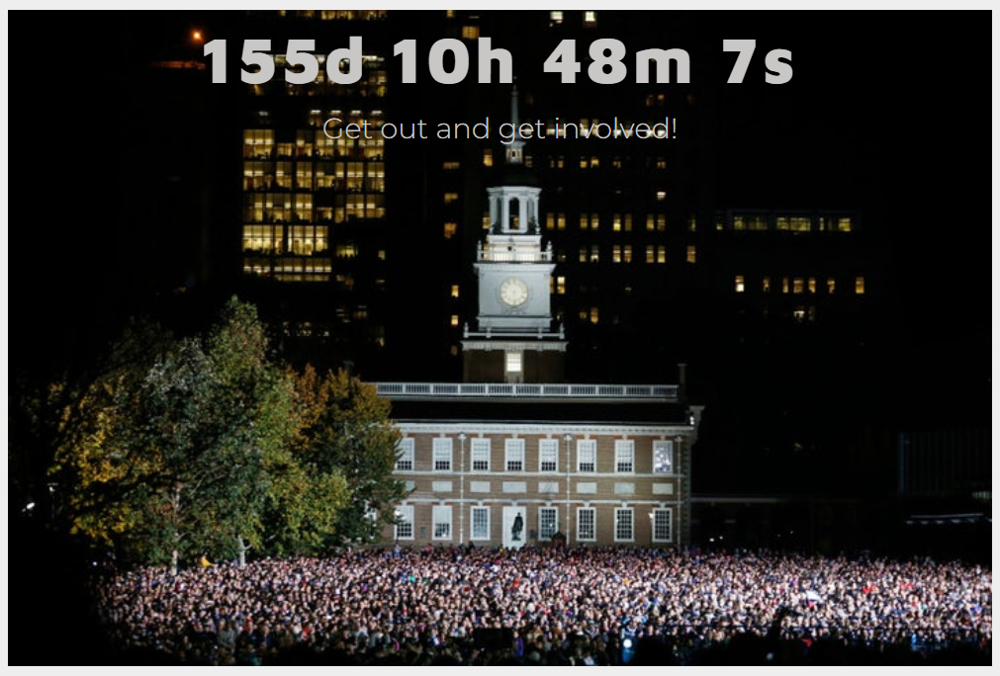

# :raising_hand: Voting-App

### Overview

This app is the work of 4 developers: Isaac Lubinski, Sara Broad, Kate Wang, and Matthew Wright

To exercise one’s right to vote is an integral part of a functional and healthy democratic form of government. It is a sacred practice given life from the very foundation of our Constitution—the right to free speech. Campaigns and candidates running for public office spend enormous amounts of money to get their message to the people. Some may label the amount as exorbitant or wasteful. In reality, spending money is an effective way to win elections, and elections count and therefore every vote counts. 

<strong>“Get Out and Get Involved”</strong> is a non-partisan group committed to strengthening the noble exercise of your right to vote by connecting enthusiastic volunteers to political campaigns in need of help on election day. Through our efforts we can help campaigns spend their money more efficiently by helping them to spread their message while amplifying your personal convictions about how your local government works. 

If you are a representative of a campaign, register your event to connect with those willing to help you. If you are a concerned voter, register to volunteer at a polling station to help spread the word. 

 Please check out the launched app on Heroku <strong>[here](https://mighty-basin-40310.herokuapp.com/)</strong>.

### Functionality and Design
We decided we would focus on 3 major areas:
  
  1. <strong>Database</strong> The database is comprised of 3 models: Manager Info, Volunteer Info and Campaing Events.  1 more model was also created by joining the Campain Event and Volunteer databases.  The models are constructed using sequelize.
  
  2. <strong>Logic and Routing</strong> We created routes to POST and GET data to and from the datanase base.  The POST routes write data to the database and are triggered by an event listener. The GET routes fetches data from the database to display in the DOM using ajax calls.
  
  3. <strong>Desgin</strong> We wanted the design to be simple, but inspiring.   The black and white color scheme artistically showcases and symbolized the rawness and power the people wield in a civilized society.  From a functional perspective it is easy to navigate and invites the user to delve deeper into the site’s confines.  The site is created using BootStrap 4, CSS and javascript
  

### Screenshot

### Languages and Technology
* Node
* Express
* MySql
* Sequelize
* Handlebars
* javascript
* Jquery
* Bootstrap 4
* CSS

### Additions to be Made

* Stronger authentication on front and back ends
* Strategize if we need additional data from users
* Send reminders for scheduled events
* Allow users to update their information
